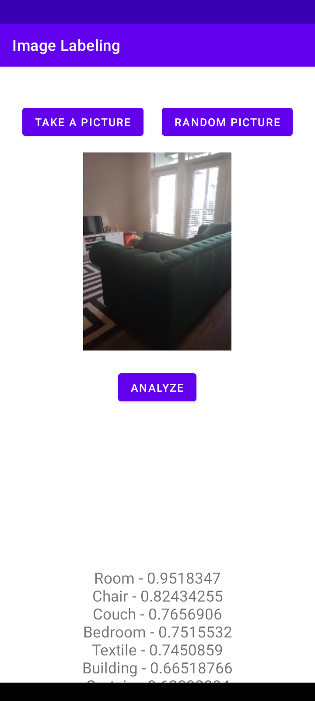
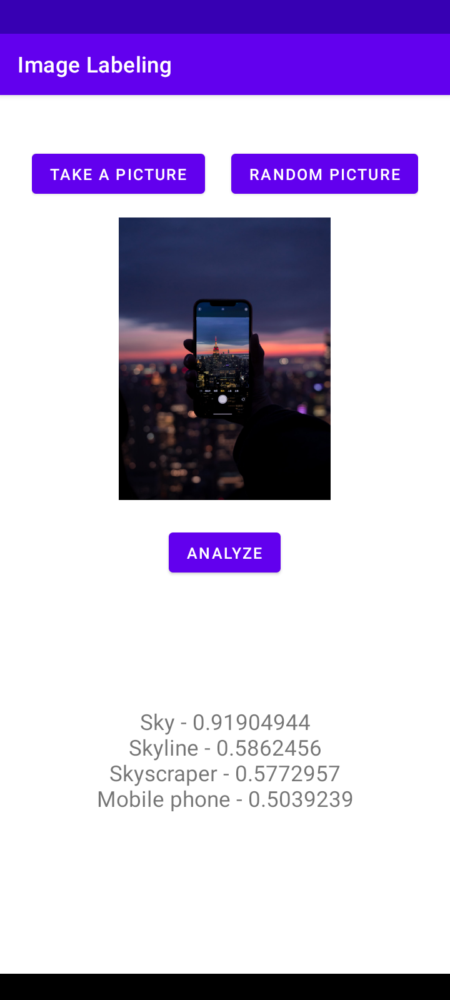

# ImageLabelingApp
An Android app that uses Machine Learning (ML) to recognize the objects in a random image from [Unsplash API](https://unsplash.com/documentation) or from an image captured from the phone’s camera.

Minimum Api Level : 22

compileSdkVersion : 31

Build System : [Gradle](https://gradle.org/)

## Table of Contents

- [Libraries](#libraries)
- [Demo](#demo)

### Android Architecture Components

- LiveData
- ViewModel

### Concurrency

- Coroutines

## Libraries

#### Third-Party
- [Glide](https://github.com/bumptech/glide) - Image loading
- [Moshi](https://github.com/square/moshi) - JSON deserialization
- [Retrofit 2](https://square.github.io/retrofit/) - REST API access
- [ML Kit Image Labeling](https://developers.google.com/ml-kit/vision/image-labeling/android) - Machine learning

## Demo

|||

